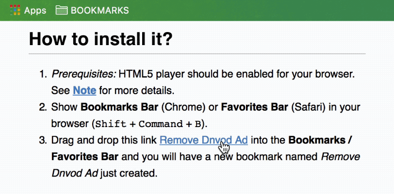

# Dnvod Ad Remover
This is a tool created to remove ad on www.dnvod.tv.

## What it can do?

1. Remove Ad from current dnvod.tv video page
2. Autoplay the video
3. Automatically full screen the video
 
## How to install it?

0. *Prerequisites:* HTML5 player should be enabled for your browser. See **[Note](#Note)** for more details. 
1. Show **Bookmarks Bar** (Chrome) or **Favorites Bar** (Safari) in your browser (<kbd>Shift</kbd> + <kbd>Command</kbd> + <kbd>B</kbd>).
2. Drag and drop this link <a href="javascript:(function(){var p=document.getElementById('video').getElementsByTagName('video')[0];p.play();p.webkitRequestFullScreen();document.getElementsByClassName('HTML5-only')[0].removeChild(document.getElementsByClassName('ads-control')[0]);})();">Remove Dnvod Ad</a> into the **Bookmarks / Favorites Bar** and you will have a new bookmark named *Remove Dnvod Ad* just created.

## How to use it?

Just click the bookmark, whenever you need to remove the ad from a dnvod video page.

<iframe width="560" height="315" src="https://www.youtube.com/embed/fHzvfbwpcxU?rel=0" frameborder="0" allowfullscreen></iframe>

	

## Note
1. Since the way an ad is shown is subject to change, this tool might not work forever. Make good use of it before it's gone.
2. This tool only works with HTML5 player. So if it did not work in your Chrome,
	- Update Chrome to the latest version and make sure to disable Flash player so that HTML5 player is automatically enabled and this tool would work hopefully. The way to disable Flash in Chrome: Go to **Settings** | Show **Advanced** settings | **Privacy and security** | **Content settings** | **Flash**, OR simply search "Flash" in **Settings**, then **Block sites from running Flash** and restart your browser. If you are not willing to block, try **Ask first**. 
	- OR install Google Chrome Canary.

## Acknowledgment
Thanks to [JBWKZsf](https://github.com/JBWKZsf) and [kevinscake](https://github.com/kevinscake) for testing!
This tool is inspired by [YouKu HTML5 Player](http://zythum.free.bg/youkuhtml5playerbookmark/). 
