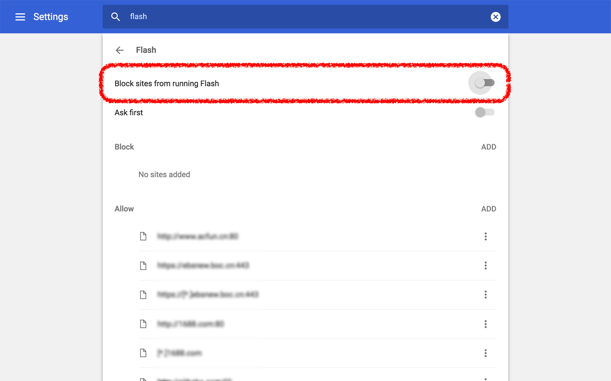

# 禁用 Flash

如果你刚才看到了这种不堪入目的画面

说明：

1. 你来对地方了
2. 你需要禁用 Flash

## 如何禁用 Chrome 浏览器里的 Flash？
打开[浏览器的 Flash 设置页](chrome://settings/content/flash)后如图设置：

然后刷新一下刚才的视频页，广告就不见了！

--
如果暂时不想对所有网站禁用 Flash，你可以选择**只对多瑙影院网站（www.dnvod.tv）禁用 Flash**。

具体方法是：

1. 打开[浏览器的 Flash 设置页](chrome://settings/content/flash)

	
	
2. 添加（ADD）想要禁用 Flash 的网站 `www.dnvod.tv`

	

3. 确认添加结果

	

4. 刷新多瑙影院视频页即可看到没有广告的视频了！

## 为什么要在我的浏览器里禁用 Flash？

1. 你不喜欢多瑙上每个视频前的 70 秒的广告。
2. 你不喜欢 MacBook 播放视频时烦人的风扇声。
3. Flash 已经属于被淘汰的互联网技术。相关新闻：
	- [Flash已死：Adobe鼓励开发人员使用HTML5](http://tech.163.com/15/1202/05/B9QC8E2G000915BF.html)（2015年）
	- [互联网告别Flash时代：Adobe宣布将于2020年正式停止开发和更新](http://money.163.com/17/0726/09/CQ8T30NH002580S6.html)（2017年）
	- [人类终于告别Flash了](#)（2020年）（误

## 致谢
感谢 [@stellazyj](https://www.instagram.com/stellazyj/) 和 [@piecejnn](https://www.instagram.com/piecejnn/) 提交 bug！

