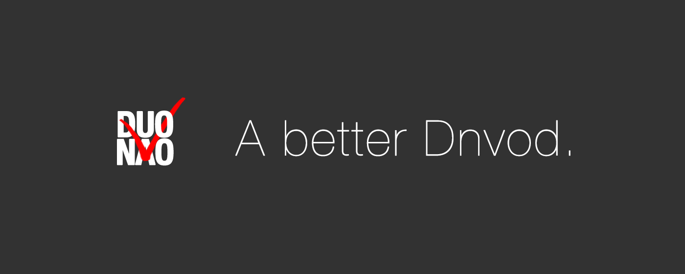
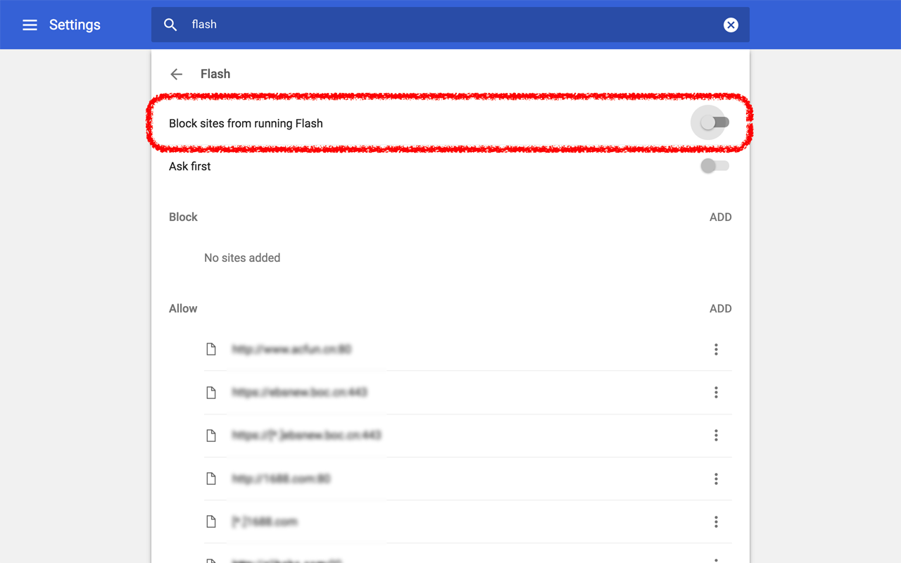

# A Better Dnvod (Dnvod Ad Remover)

This Chrome Extension removes all ads from dnvod.tv pages. 

## Features

Demo: https://www.youtube.com/watch?v=AfEonBBrtIM

<iframe width="560" height="315" src="https://www.youtube.com/embed/xmspuJlGAfk?rel=0" frameborder="0" allowfullscreen></iframe>

- Removing ALL ads
- Shortcuts for playback
	- double click: enter / exit full-screen
	- <kbd>space</kbd> OR <kbd>enter</kbd>: play / pause
	- <kbd>←</kbd>/<kbd>→</kbd>: Jump 8 seconds back / forward
- Autoplay 
	- current episode when loaded
	- next episode (coming soon)

## Links

- [Extension on Chrome Web Store](https://chrome.google.com/webstore/detail/dnvod-ad-remover/iogpccakojnbjlglnkbmkgafekcokcjk?hl=en-US)
- [Repository on GitHub](dnvod-ad-remover-chrome-extension)

## Note

1. Since the way an ad is shown is subject to change, this tool might not work forever. Make good use of it before it's gone.
2. This tool only works with HTML5 player. So if it did not work in your Chrome,
	- Update Chrome to the latest version and make sure to disable Flash player so that HTML5 player is automatically enabled and this tool would work hopefully. The way to disable Flash in Chrome: Go to **Settings** | Show **Advanced** settings | **Privacy and security** | **Content settings** | **Flash**, OR simply search "Flash" in **Settings**, then **Block sites from running Flash** and restart your browser. 
		
	- OR install Google Chrome Canary.

## Browser Bookmark Version

There is also a super light-weighted **Browser Bookmark** version available [here](browser-bookmark.html).

## Acknowledgment

Thanks to [JBWKZsf](https://github.com/JBWKZsf) and [kevinscake](https://github.com/kevinscake) for testing!
This tool is inspired by [YouKu HTML5 Player](http://zythum.free.bg/youkuhtml5playerbookmark/). 
