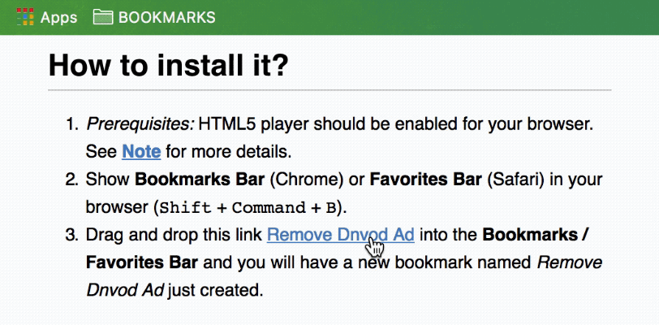

# Dnvod Ad Remover

This Chrome Extension removes all ads from dnvod.tv pages. 

https://www.youtube.com/watch?v=AfEonBBrtIM

<iframe width="560" height="315" src="https://www.youtube.com/embed/AfEonBBrtIM?rel=0" frameborder="0" allowfullscreen></iframe>

- [Extension on Chrome Web Store](https://chrome.google.com/webstore/detail/dnvod-ad-remover/iogpccakojnbjlglnkbmkgafekcokcjk?hl=en-US)
- [Repository on GitHub](dnvod-ad-remover-chrome-extension)

## Note

1. Since the way an ad is shown is subject to change, this tool might not work forever. Make good use of it before it's gone.
2. This tool only works with HTML5 player. So if it did not work in your Chrome,
	- Update Chrome to the latest version and make sure to disable Flash player so that HTML5 player is automatically enabled and this tool would work hopefully. The way to disable Flash in Chrome: Go to **Settings** | Show **Advanced** settings | **Privacy and security** | **Content settings** | **Flash**, OR simply search "Flash" in **Settings**, then **Block sites from running Flash** and restart your browser. 
		
	- OR install Google Chrome Canary.

---

# Browser Bookmark Version

There is also a Browser Bookmark version of it. It only has the minimal ability to remove dnvod.tv ads.

## How to install it?

0. *Prerequisites:* HTML5 player should be enabled for your browser. See **[Note](#Note)** for more details. 
1. Show **Bookmarks Bar** (Chrome) or **Favorites Bar** (Safari) in your browser (<kbd>Shift</kbd> + <kbd>Command</kbd> + <kbd>B</kbd>).
2. Drag and drop this link <a href="javascript:(function(){var p=document.getElementById('video').getElementsByTagName('video')[0];p.play();document.getElementsByClassName('HTML5-only')[0].removeChild(document.getElementsByClassName('ads-control')[0]);})();">Remove Dnvod Ad</a> into the **Bookmarks / Favorites Bar** and you will have a new bookmark named *Remove Dnvod Ad* just created.

## How to use it?

Just click the bookmark, whenever you need to remove the ad from a dnvod video page.

<iframe width="560" height="315" src="https://www.youtube.com/embed/fHzvfbwpcxU?rel=0" frameborder="0" allowfullscreen></iframe>

## Acknowledgment

Thanks to [JBWKZsf](https://github.com/JBWKZsf) and [kevinscake](https://github.com/kevinscake) for testing!
This tool is inspired by [YouKu HTML5 Player](http://zythum.free.bg/youkuhtml5playerbookmark/). 
